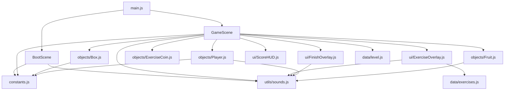
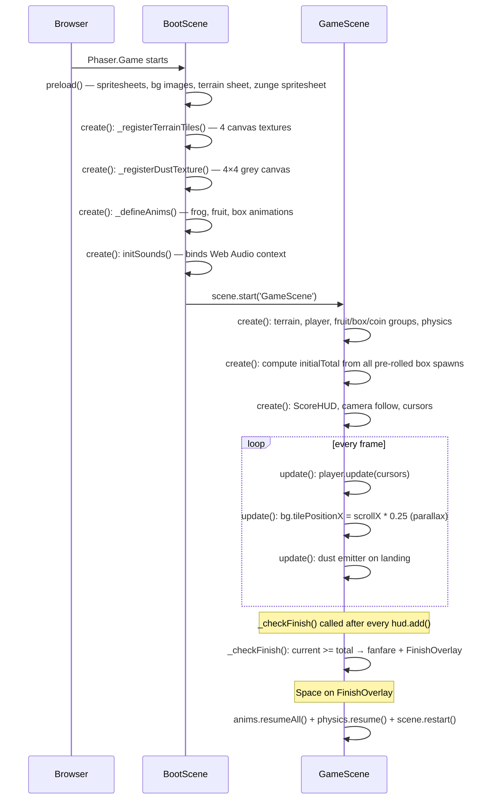

# Architecture

## Big picture

Pitzi side-scroller is a browser-based 2D platformer that runs entirely client-side — no server, no backend, no persistence across page loads.

```
Browser
  └── Phaser.Game  (400×240 logical canvas, zoom×2 → 800×480 on screen)
        ├── BootScene   — load assets, build textures, define animations, init sounds
        └── GameScene   — world, physics, scoring, game loop
```

Stack: **Phaser 3.80.1** + **Vite 5** (dev server / bundler), plain ES-module JavaScript.

---

## File map

```
src/
  main.js              Phaser.Game config — registers scenes, sets gravity & zoom
  constants.js         All tuning numbers (speeds, tile size, world bounds, BOX_FRUIT_CHANCE)

  scenes/
    BootScene.js       Preload all assets → extract terrain tiles → register dust texture
                       → load 'zunge' spritesheet → define animations → initSounds()
                       → start GameScene
    GameScene.js       Build world (terrain, groups, physics), pre-calculate score total,
                       update() loop, _checkFinish(), _overlayActive guard

  objects/
    Player.js          Ninja Frog — dynamic physics body, input handler, animation state machine
                       coyote-time, double-jump, wall-jump
    Fruit.js           Static collectible — overlap → sparkle anim → destroy
    Box.js             Breakable sprite — spawnType pre-rolled in constructor,
                       hit-from-below detection, hit+break anim sequence, spawn callback
    ExerciseCoin.js    Floating gold coin — spawned by boxes or pre-placed in level;
                       spawn scale anim, float tween, triggers overlay on overlap

  data/
    level.js           FRUITS[], BOXES[], COINS[] spawn lists (static, never mutated)
    exercises.js       EXERCISES[] — 6 entries: { frame, label }
                       frame = 0-based index into 'zunge' spritesheet

  ui/
    ExerciseOverlay.js Pause overlay — sprite illustration, label, 5s countdown, reward
    ScoreHUD.js        Fixed HUD (top-right): current / total points
    FinishOverlay.js   End-of-level screen — confetti cannons, firework pops, score, restart

  utils/
    sounds.js          Web Audio API synthesizer — initSounds(scene) + SFX object

assets/
  PixelAdventure/      Sprite pack (do not modify)
  spritepack-zunge.png 1450×736, 5 cols × 2 rows, 290×368 per cell
```

---

## Module dependency graph



---

## Scene lifecycle



---

## Coordinate system

All coordinates in the source are **logical pixels** (400×240 canvas).  
`zoom: 2` doubles everything for display — never work in screen pixels.

| Constant   | Value  | Meaning |
|------------|--------|---------|
| `TILE`     | 16 px  | One terrain tile (renders at 32 px on screen) |
| `WORLD_W`  | 2048 px | Scrollable world width — 128 tiles |
| `WORLD_H`  | 240 px | World height, matches canvas |
| `GROUND_Y` | 224 px | Top surface y of the ground row |

---

## Physics summary

Arcade Physics, `gravity.y = 400`.

| Object | Body type | Collision |
|--------|-----------|-----------|
| Player | Dynamic | `collider` with terrain |
| Terrain platforms | Static (StaticGroup) | — |
| Fruit | Static, no gravity | `overlap` with player only |
| Box | Static | `overlap` with player only — player passes through |
| ExerciseCoin | Static, no gravity | `overlap` with player only |

**Boxes use overlap, not collider.** The player passes through a box from below; a hit is only registered when `player.body.velocity.y < -20 && player.body.y > box.body.y`.

**StaticBody sizing:** Each platform generates a runtime texture `plat-${w}` exactly `w × TILE` pixels wide so the StaticBody inherits correct dimensions automatically. `refreshBody()` is called after creation to commit the size.

---

## Score & finish system

All box spawn outcomes (`'exercise'` or a fruit type) are **pre-rolled in `Box` constructors** before the HUD is created. `GameScene.create()` then sums:

```
initialTotal = FRUITS.length × 1  +  COINS.length × 5  +  Σ(box.spawnType === 'exercise' ? 5 : 1)
```

The total is immutable during play. `_checkFinish()` is called after every `hud.add()`; it triggers the finish sequence when `current >= total`, guarded by `_overlayActive` to prevent the FinishOverlay from appearing while an ExerciseOverlay is still open.

**Scene restart caveat:** `anims.pauseAll()` sets a flag on Phaser's game-level `AnimationManager` (not scene-level). This flag survives `scene.scene.restart()`. FinishOverlay therefore calls `scene.anims.resumeAll()` and `scene.physics.resume()` before restarting, so the new game starts with animations running.
