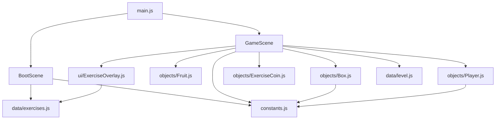
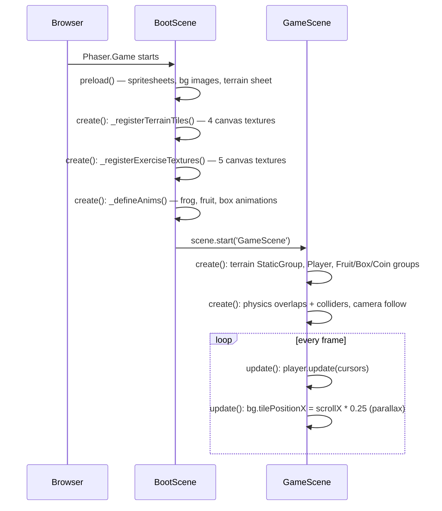

# Architecture

## Big picture

Pitzi side-scroller is a browser-based 2D platformer that runs entirely client-side — no server, no backend, no persistence across page loads.

```
Browser
  └── Phaser.Game  (400×240 logical canvas, zoom×2 → 800×480 on screen)
        ├── BootScene   — load assets, build textures, define animations
        └── GameScene   — world, physics, game loop
```

Stack: **Phaser 3.80.1** + **Vite 5** (dev server / bundler), plain ES-module JavaScript.

---

## File map

```
src/
  main.js              Phaser.Game config — registers scenes, sets gravity & zoom
  constants.js         All tuning numbers (speeds, tile size, world bounds, probabilities)

  scenes/
    BootScene.js       Preload all assets → extract terrain tiles → register
                       exercise canvas textures → define animations → start GameScene
    GameScene.js       Build world (terrain, groups, physics) + update() loop

  objects/
    Player.js          Ninja Frog — dynamic physics body, input handler, animation state machine
    Fruit.js           Static collectible — overlap → sparkle anim → destroy
    Box.js             Breakable sprite — hit-from-below detection, spawn callback
    ExerciseCoin.js    Floating gold coin — spawned by broken boxes, triggers overlay

  data/
    level.js           FRUITS[] and BOXES[] spawn lists  (static, never mutated)
    exercises.js       EXERCISES[] — 5 tongue-exercise definitions (static)

  ui/
    ExerciseOverlay.js Pause overlay — illustration, label, Space-to-dismiss
```

---

## Module dependency graph



---

## Scene lifecycle



---

## Coordinate system

All coordinates in the source are **logical pixels** (400×240 canvas).  
`zoom: 2` doubles everything for display — never work in screen pixels.

| Constant   | Value  | Meaning |
|------------|--------|---------|
| `TILE`     | 16 px  | One terrain tile (renders at 32 px on screen) |
| `WORLD_W`  | 2048 px | Scrollable world width — 128 tiles |
| `WORLD_H`  | 240 px | World height, matches canvas |
| `GROUND_Y` | 224 px | Top surface y of the ground row |

---

## Physics summary

Arcade Physics, `gravity.y = 400`.

| Object | Body type | Collision |
|--------|-----------|-----------|
| Player | Dynamic | `collider` with terrain |
| Terrain platforms | Static (StaticGroup) | — |
| Fruit | Static, no gravity | `overlap` with player only |
| Box | Static | `overlap` with player only — player passes through |
| ExerciseCoin | Static, no gravity | `overlap` with player only |

**Boxes use overlap, not collider.** The player passes through a box from below; a hit is only registered when `player.body.velocity.y < -20 && player.body.y > box.body.y`.

**StaticBody sizing:** Each platform generates a runtime texture `plat-${w}` exactly `w × TILE` pixels wide so the StaticBody inherits correct dimensions automatically. `refreshBody()` is called after creation to commit the size.
