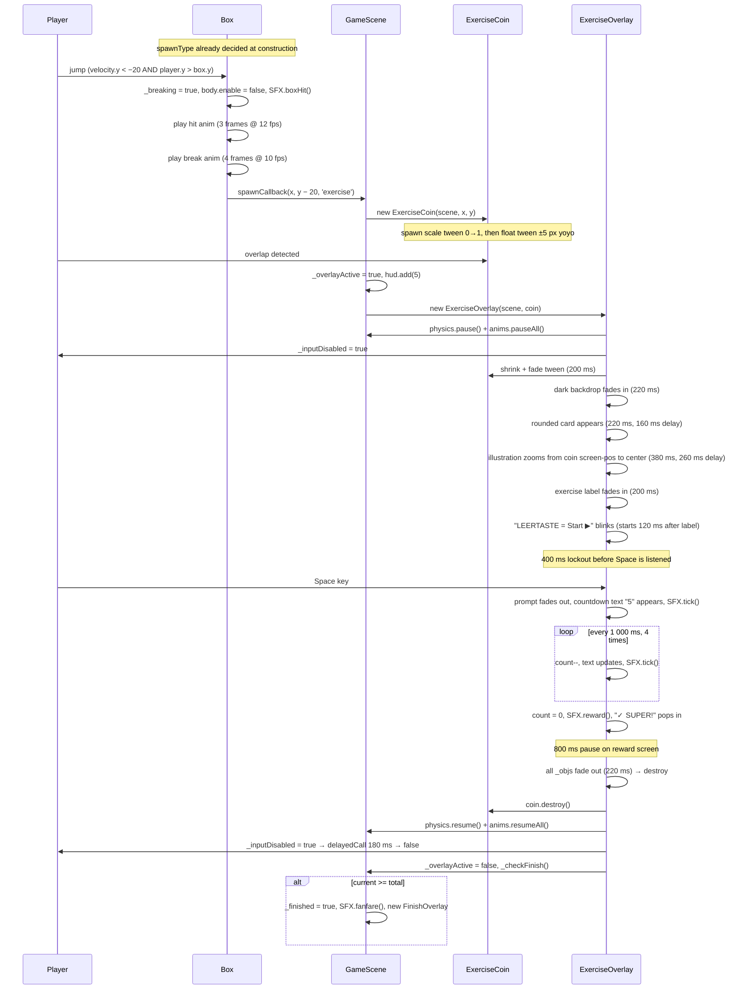

# Exercise Flow

The therapeutic core mechanic: from box hit to game resume.

---

## Full sequence



---

## Timing reference

| Step | Duration | Delay from previous |
|------|----------|---------------------|
| Coin shrink + fade | 200 ms | — |
| Backdrop fade in | 220 ms | — |
| Card fade in | 220 ms | 160 ms |
| Illustration zoom to center | 380 ms | 260 ms |
| Exercise name fade in | 200 ms | after illustration complete |
| Prompt fade in + blink start | 200 ms | 120 ms after name |
| Space listener enabled | — | 400 ms after prompt appears |
| Countdown tick interval | 1 000 ms × 5 | after Space pressed |
| Reward "SUPER!" pop-in | 250 ms | at count = 0 |
| Auto-dismiss | — | 800 ms after reward |
| Dismiss fade out | 220 ms | — |
| Input re-enable + _checkFinish | — | 180 ms after dismiss |

---

## Exercise definitions

Defined in `src/data/exercises.js`. Each entry:

```js
{ frame: 0, label: 'Zunge zur Nase' }
```

`frame` is the 0-based index into the `'zunge'` spritesheet (5 columns × 2 rows, 290×368 px per cell, loaded from `assets/spritepack-zunge.png`).

| frame | Label | Movement |
|-------|-------|----------|
| 0 | Zunge zur Nase | Tongue up to nose |
| 1 | Zunge nach rechts | Tongue right |
| 2 | Zunge zum Kinn | Tongue down to chin |
| 4 | Backen aufpusten | Puff both cheeks |
| 7 | Zunge nach rechts oben | Tongue upper-right |
| 9 | Zunge in die Wange links | Tongue into left cheek |

### How illustrations are displayed

```
'zunge' spritesheet (loaded in BootScene.preload())
    └── frame index from EXERCISES[i].frame
          └── scene.add.image(x, y, 'zunge', frame)   ← ExerciseOverlay
                └── scale 0.03 → tween → 0.27  (fits ~78×99 px inside the card)
```

---

## Scoring

Points are awarded the moment the coin is touched — before the overlay opens:

```js
// GameScene.triggerExercise()
this._overlayActive = true;   // block _checkFinish while overlay is open
this.hud.add(5);
this._checkFinish();           // no-op (overlayActive = true)
new ExerciseOverlay(this, coin);
```

`_checkFinish()` runs again after `_dismiss()` clears `_overlayActive`, so the finish sequence starts cleanly after the overlay closes if this was the last collectible.

---

## Where the feedback lives

```
Concern                       File / Property
──────────────────────────────────────────────────────────────────
Exercise content              src/data/exercises.js — EXERCISES[]
Spritesheet                   assets/spritepack-zunge.png, key 'zunge'
Exercise selection (random)   src/ui/ExerciseOverlay.js — constructor
Overlay rendering             src/ui/ExerciseOverlay.js — _show(), _showText()
Countdown + reward            src/ui/ExerciseOverlay.js — _startCountdown(), _showReward()
Space listener + dismiss      src/ui/ExerciseOverlay.js — _showText(), _dismiss()
Game pause / resume           src/ui/ExerciseOverlay.js — physics + anims
Input gate                    src/objects/Player.js — _inputDisabled flag
Overlay-active gate           src/scenes/GameScene.js — _overlayActive flag
Score addition                src/scenes/GameScene.js — triggerExercise() → hud.add(5)
Finish check                  src/scenes/GameScene.js — _checkFinish()
```

**Nothing is recorded.** There is no log of which exercises were shown or confirmed. If session tracking is ever needed, add a `src/data/session.js` module and call its record function from `ExerciseOverlay._dismiss()`.

---

## Randomness

Two random decisions happen per play-through, both using plain `Math.random()` — no seed, no weighting, no repeat-prevention:

1. **What does each box spawn?** — `Box` constructor: `Math.random() >= BOX_FRUIT_CHANCE` → `'exercise'`; otherwise a random type from `FRUIT_TYPES[]`. Decided **at level load**, not when the box is hit — so the score total is fixed before the first frame.

2. **Which exercise shows?** — `ExerciseOverlay` constructor: `EXERCISES[Math.floor(Math.random() * EXERCISES.length)]`. Decided when the coin is collected.
