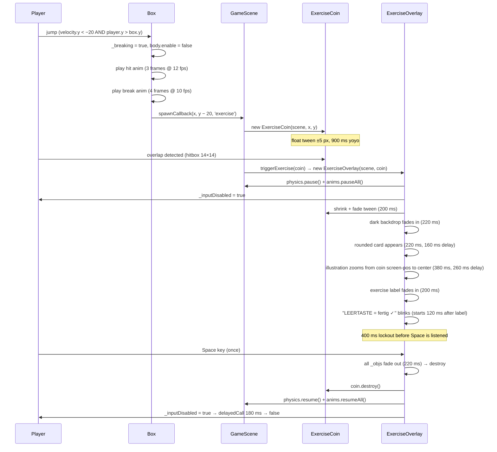

# Exercise Flow

The therapeutic core mechanic: from box hit to game resume.

---

## Full sequence



---

## Timing reference

| Step | Duration | Delay |
|------|----------|-------|
| Coin shrink + fade | 200 ms | — |
| Backdrop fade in | 220 ms | — |
| Card fade in | 220 ms | 160 ms |
| Illustration zoom to center | 380 ms | 260 ms |
| Exercise name fade in | 200 ms | after illustration complete |
| Prompt fade in | 200 ms | 120 ms after name |
| Space listener lockout | 400 ms | after prompt appears |
| Dismiss fade out | 220 ms | — |
| Input re-enable delay | 180 ms | after dismiss |

---

## Exercise definitions

Defined in `src/data/exercises.js`. Each entry:

```js
{
  key:        'ex-tongue-nose',    // Phaser texture key
  label:      'Zunge zur Nase',    // shown on the card
  drawCanvas: (ctx) => { ... }     // draws a 64×64 face onto a Canvas 2D context
}
```

The five exercises:

| Key | Label | Tongue |
|-----|-------|--------|
| `ex-tongue-nose`  | Zunge zur Nase    | Up — drawn **before** `drawBase()` so the face overlaps the tongue root |
| `ex-tongue-chin`  | Zunge zum Kinn   | Down |
| `ex-tongue-left`  | Zunge nach links  | Left |
| `ex-tongue-right` | Zunge nach rechts | Right |
| `ex-home-spot`    | Zunge nach Hause  | At rest (small dot behind upper incisors) |

### How textures are built

At boot, `BootScene._registerExerciseTextures()` loops over `EXERCISES`, creates a `64×64` HTML canvas, calls `exercise.drawCanvas(ctx)`, then registers it with Phaser:

```
EXERCISES[]
    └── drawCanvas(ctx)        ← Canvas 2D API (circles, rects, arcs)
          └── 64×64 canvas
                └── textures.addCanvas(key, canvas)   ← Phaser texture cache
                      └── scene.add.image(x, y, key)  ← used in ExerciseOverlay
```

The illustration is shown at `scale 1.25` → 80×80 logical (160×160 on screen).

---

## Where the feedback lives

```
Concern                       File / Property
─────────────────────────────────────────────────────────────────
Exercise content              src/data/exercises.js — EXERCISES[]
Texture registration          src/scenes/BootScene.js — _registerExerciseTextures()
Exercise selection (random)   src/ui/ExerciseOverlay.js — constructor
Overlay rendering             src/ui/ExerciseOverlay.js — _show(), _showText()
Space listener + dismiss      src/ui/ExerciseOverlay.js — _showText(), _dismiss()
Game pause / resume           src/ui/ExerciseOverlay.js — physics + anims
Input gate                    src/objects/Player.js — _inputDisabled flag
Trigger point                 src/scenes/GameScene.js — triggerExercise(coin)
```

**Nothing is recorded.** There is no log of which exercises were shown or confirmed. If session tracking is ever needed, add a `src/data/session.js` module and call its record function from `ExerciseOverlay._dismiss()`.

---

## Randomness

Two random decisions happen per box hit:

1. **What spawns?** — `Box.hitFromBelow()`: `Math.random() >= BOX_FRUIT_CHANCE` (30% chance) → `'exercise'`; otherwise a random fruit type from `FRUIT_TYPES[]`.
2. **Which exercise?** — `ExerciseOverlay` constructor: `EXERCISES[Math.floor(Math.random() * EXERCISES.length)]`.

Both use plain `Math.random()` — no seed, no weighting, no repeat-prevention.
