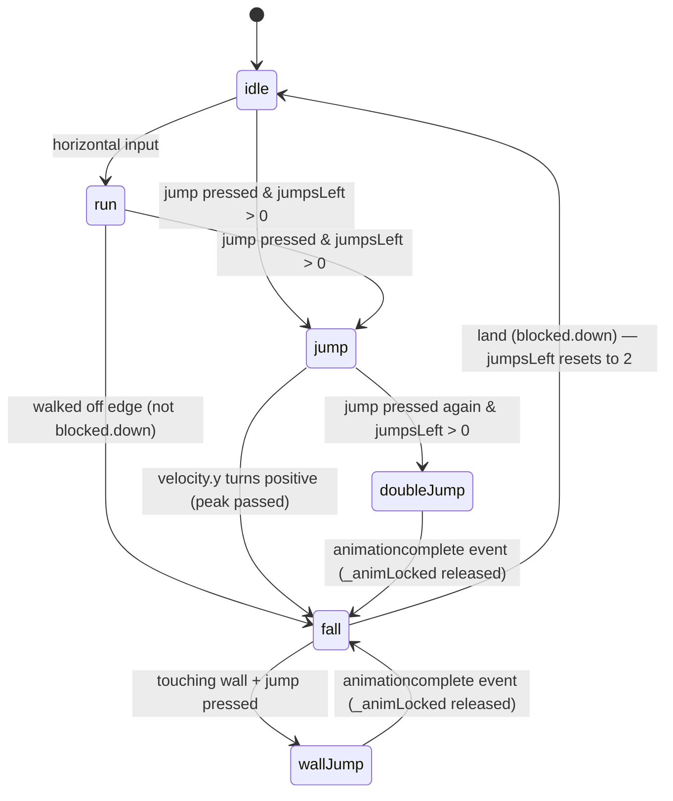

# State & Data

## Persistence model

There is **no persistent state.** Everything lives in JavaScript memory and is gone on page reload. No localStorage, no cookies, no server.

---

## Static data (defined once, never mutated at runtime)

| File | Export | What it holds |
|------|--------|---------------|
| `src/constants.js` | named exports | Tile size, world dimensions, player speeds, jump forces, `BOX_FRUIT_CHANCE` |
| `src/scenes/GameScene.js` | `PLATFORMS` (module-level const) | `[x, y, widthInTiles]` tuples — the platform layout |
| `src/data/level.js` | `FRUITS[]` | Fruit spawn positions and types |
| `src/data/level.js` | `BOXES[]` | Box spawn positions, types 1–3 |
| `src/data/exercises.js` | `EXERCISES[]` | 5 exercise definitions: `{key, label, drawCanvas}` |

---

## Runtime state

### Player (`src/objects/Player.js`)

The `Player` instance lives on `GameScene.player`.

| Property | Type | Meaning |
|----------|------|---------|
| `body.x / body.y` | number | World position — owned by Phaser Arcade Physics |
| `body.velocity` | Vec2 | Current velocity — owned by Phaser |
| `_jumpsLeft` | 0–2 | Remaining jump budget; resets to 2 on landing |
| `_wasOnGround` | bool | Previous-frame ground contact; detects the landing edge to reset `_jumpsLeft` |
| `_wallLockFrames` | 0–18 | Counts down after a wall jump; suppresses horizontal input during that window |
| `_animLocked` | bool | True while a double-jump or wall-jump animation is playing; prevents `_stepAnim` from interrupting it |
| `_inputDisabled` | bool | True while the exercise overlay is visible; causes `update()` to return immediately |

#### Player animation state machine



---

### GameScene (`src/scenes/GameScene.js`)

| Property | Type | Lifetime |
|----------|------|----------|
| `this.terrain` | Phaser StaticGroup | Created once; never changes |
| `this.fruitGroup` | Phaser Group | Starts with all FRUITS; sprites removed as they are collected |
| `this.boxGroup` | Phaser Group | Starts with all BOXES; sprites removed when broken |
| `this.coinGroup` | Phaser Group | Empty at start; coins added when boxes break, removed on collection |
| `this.player` | Player | Created once |
| `this.bg` | TileSprite | `tilePositionX` updated every frame for parallax |
| `this.cursors` | Phaser.CursorKeys | Re-read every frame in `update()` |

---

### ExerciseOverlay (`src/ui/ExerciseOverlay.js`)

Instantiated by `GameScene.triggerExercise(coin)`; destroyed when Space is pressed.

| Property | Meaning |
|----------|---------|
| `_exercise` | One randomly-chosen entry from `EXERCISES[]` |
| `_objs[]` | All Phaser display objects created for the overlay — backdrop, card, image, texts; all destroyed together on dismiss |
| `_coin` | Reference to the `ExerciseCoin` sprite — destroyed on dismiss |

---

### Phaser-internal state (not user code)

- Arcade Physics world: body positions, velocities, collision resolution
- Animation system: current frame, playback state for every sprite
- Texture cache (`scene.textures`): exercise canvases and runtime-generated `plat-${w}` textures registered here at boot
- Camera: scroll position, lerp follow

---

## Where state changes happen

```
Event                        What changes
──────────────────────────────────────────────────────────────────
Player lands                 Player._jumpsLeft = 2, _wasOnGround = true
Player jumps                 Player._jumpsLeft--, body velocity set
Player wall-jumps            Player._wallLockFrames = 18, _animLocked = true
Double/wall jump anim ends   Player._animLocked = false
Player overlaps Fruit        Fruit.body.enable = false → anim → Fruit.destroy()
                             (removed from fruitGroup automatically)
Player jumps under Box       Box._breaking = true, body.enable = false
                             → hit anim → break anim → spawnCallback → Box.destroy()
spawnCallback 'exercise'     new ExerciseCoin added to coinGroup
spawnCallback <fruit type>   new Fruit added to fruitGroup
Player overlaps ExerciseCoin coin.body.enable = false → new ExerciseOverlay
ExerciseOverlay constructs   physics.pause(), anims.pauseAll(), player._inputDisabled = true
Space pressed in overlay     all _objs destroyed, coin destroyed
                             physics.resume(), anims.resumeAll()
                             player._inputDisabled = true → 180ms → false
```

---

## What is NOT tracked (yet)

- Which exercises were shown
- How many exercises the child completed in a session
- Score or fruit-collection count
- Session duration

If session tracking is added, the right place is a dedicated module (e.g. `src/data/session.js`) updated from `ExerciseOverlay._dismiss()`. It should remain separate from `level.js` and `exercises.js`, which are pure static data.
