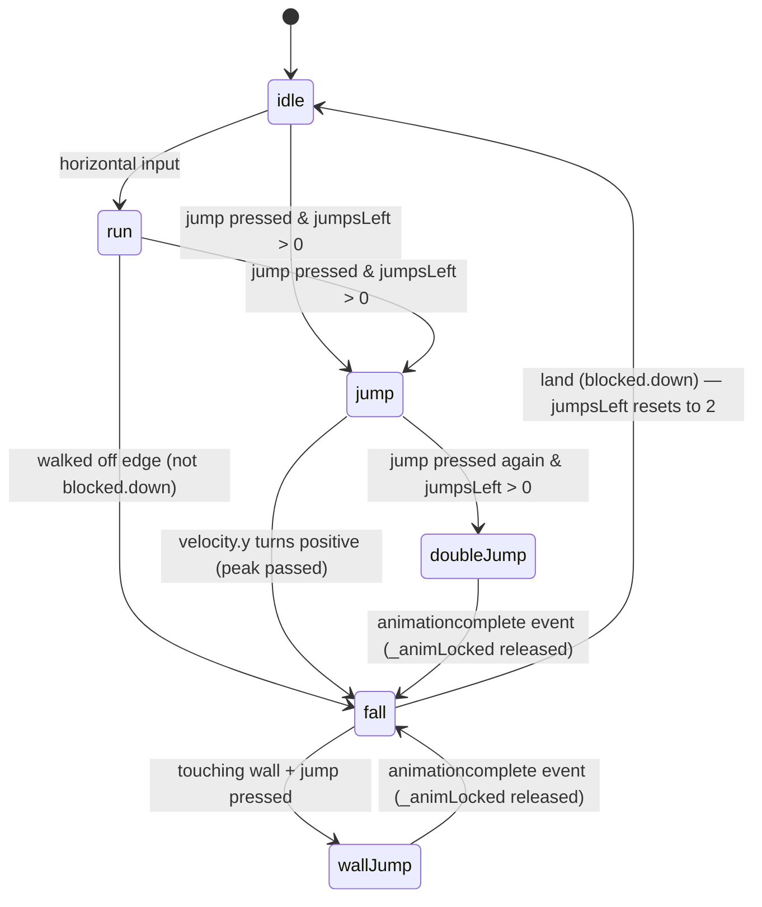

# State & Data

## Persistence model

There is **no persistent state.** Everything lives in JavaScript memory and is gone on page reload. No localStorage, no cookies, no server.

---

## Static data (defined once, never mutated at runtime)

| File | Export | What it holds |
|------|--------|---------------|
| `src/constants.js` | named exports | Tile size, world dimensions, player speeds, jump forces, `BOX_FRUIT_CHANCE` |
| `src/scenes/GameScene.js` | `PLATFORMS` (module-level const) | `[x, y, widthInTiles]` tuples — the platform layout |
| `src/data/level.js` | `FRUITS[]` | Fruit spawn positions and types (20 fruits) |
| `src/data/level.js` | `BOXES[]` | Box spawn positions, types 1–3 (13 boxes) |
| `src/data/level.js` | `COINS[]` | Pre-placed exercise coin positions (5 coins) |
| `src/data/exercises.js` | `EXERCISES[]` | 6 exercise definitions: `{ frame, label }` — `frame` indexes into the `'zunge'` spritesheet |

---

## Runtime state

### Player (`src/objects/Player.js`)

The `Player` instance lives on `GameScene.player`.

| Property | Type | Meaning |
|----------|------|---------|
| `body.x / body.y` | number | World position — owned by Phaser Arcade Physics |
| `body.velocity` | Vec2 | Current velocity — owned by Phaser |
| `_jumpsLeft` | 0–2 | Remaining jump budget; resets to 2 on landing |
| `_coyoteFrames` | 0–8 | Counts down after walking off an edge; allows a jump during this window |
| `_wallLockFrames` | 0–18 | Counts down after a wall jump; suppresses horizontal input during that window |
| `_animLocked` | bool | True while a double-jump or wall-jump animation is playing; prevents `_stepAnim` from interrupting it |
| `_inputDisabled` | bool | True while exercise overlay is visible or finish sequence is running; causes `update()` to return immediately |

#### Player animation state machine



---

### GameScene (`src/scenes/GameScene.js`)

| Property | Type | Lifetime |
|----------|------|----------|
| `this.terrain` | Phaser StaticGroup | Created once; never changes |
| `this.fruitGroup` | Phaser Group | Pre-placed fruits; sprites removed as collected |
| `this.boxGroup` | Phaser Group | All boxes; sprites removed when broken |
| `this.coinGroup` | Phaser Group | Pre-placed coins + coins spawned from boxes; removed on collection |
| `this.player` | Player | Created once |
| `this.hud` | ScoreHUD | Fixed total computed at create(); `current` increments on collection |
| `this.bg` | TileSprite | `tilePositionX` updated every frame for parallax |
| `this.cursors` | Phaser.CursorKeys | Re-read every frame in `update()` |
| `this._finished` | bool | Set true when finish sequence starts; prevents double-trigger |
| `this._overlayActive` | bool | True while ExerciseOverlay is open; gates `_checkFinish()` |
| `this._playerWasOnGround` | bool | Previous-frame ground state; edge-detects landing for dust + sound |

---

### Box (`src/objects/Box.js`)

| Property | Meaning |
|----------|---------|
| `spawnType` | `'exercise'` or a fruit-type string — decided by `Math.random()` **at construction**, before play starts |
| `_breaking` | True once `hitFromBelow()` is called; prevents re-triggering during the animation sequence |

---

### ExerciseOverlay (`src/ui/ExerciseOverlay.js`)

Instantiated by `GameScene.triggerExercise(coin)`; destroyed when the countdown completes.

| Property | Meaning |
|----------|---------|
| `_exercise` | One randomly-chosen entry from `EXERCISES[]` |
| `_objs[]` | All Phaser display objects for the overlay — destroyed together on dismiss |
| `_coin` | Reference to the `ExerciseCoin` sprite — destroyed on dismiss |
| `_illo` | The illustration image (`'zunge'` spritesheet frame) — tracked separately for scale tweens |

---

### Phaser-internal state (not user code)

- Arcade Physics world: body positions, velocities, collision resolution
- Animation system: current frame, playback state for every sprite — **game-level** (`scene.anims` is shared), so `anims.pauseAll()` / `resumeAll()` affects the entire game
- Texture cache (`scene.textures`): runtime-generated `plat-${w}` and `dust` textures; `'zunge'` spritesheet; box/fruit/frog spritesheets
- Camera: scroll position, lerp follow

---

## Where state changes happen

```
Event                          What changes
──────────────────────────────────────────────────────────────────────────
Player lands                   Player._jumpsLeft = 2, _coyoteFrames = 0
                               dust emitter burst, SFX.land()
Player walks off edge          Player._coyoteFrames = COYOTE_FRAMES (8)
Player jumps (ground/coyote)   Player._jumpsLeft--, body velocity set, SFX.jump()
Player double-jumps            Player._jumpsLeft = 0, _animLocked = true, SFX.doublejump()
Player wall-jumps              Player._wallLockFrames = 18, _animLocked = true
Double/wall jump anim ends     Player._animLocked = false
Player overlaps Fruit          Fruit.collect() → sparkle anim → destroy (fruitGroup shrinks)
                               hud.add(1), _checkFinish()
Player overlaps ExerciseCoin   GameScene._overlayActive = true
                               hud.add(5), _checkFinish() (no-op — overlayActive)
                               coin.body.enable = false → new ExerciseOverlay
Box.hitFromBelow()             Box._breaking = true, body.enable = false, SFX.boxHit()
                               → hit anim → break anim → spawnCallback(x, y, spawnType) → destroy
spawnCallback 'exercise'       new ExerciseCoin added to coinGroup
spawnCallback <fruit type>     new Fruit added to fruitGroup
ExerciseOverlay constructs     physics.pause(), anims.pauseAll(), player._inputDisabled = true
Countdown reaches 0            SFX.reward(), "SUPER!" shown, auto-dismiss after 800ms
ExerciseOverlay dismisses      _objs destroyed, coin destroyed
                               physics.resume(), anims.resumeAll()
                               player._inputDisabled = true → 180ms → false
                               _overlayActive = false, _checkFinish()
_checkFinish() fires           if current >= total && !_finished && !_overlayActive:
                               _finished = true, player._inputDisabled = true
                               physics.pause(), anims.pauseAll()
                               SFX.fanfare(), new FinishOverlay
Space on FinishOverlay         emitters destroyed, anims.resumeAll(), physics.resume()
                               scene.scene.restart()
```

---

## What is NOT tracked

- Which specific exercises were shown in a session
- How many exercises the child completed
- Session duration

If session tracking is added, the right place is a dedicated module (e.g. `src/data/session.js`) updated from `ExerciseOverlay._dismiss()`. It should remain separate from `level.js` and `exercises.js`, which are pure static data.
